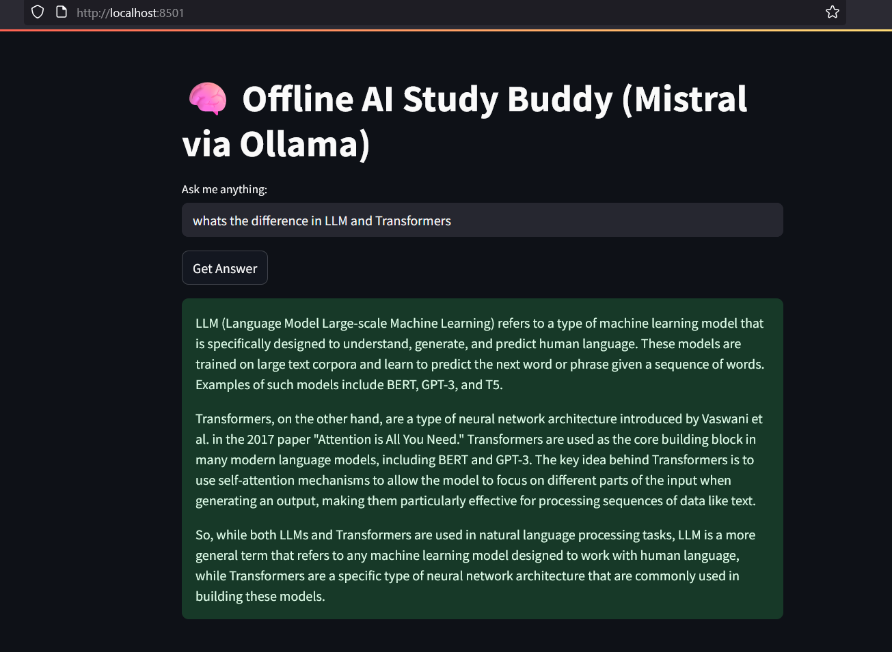

# 🧠 Offline AI Study Buddy

A completely local, offline AI chatbot powered by the Mistral LLM using [Ollama](https://ollama.com/).  
Ask any question and get helpful, structured answers — **no API key or internet required** after setup.

✅ Built with Python, Streamlit, and Ollama.

---

## 🧠 How It Works

This project uses:
- 🧠 `Mistral 7B` running locally via Ollama
- 💬 Python `requests` to send prompts to `localhost:11434`
- 🖥️ Streamlit to create a simple web UI

---

## 🚀 Features

- Run fully offline — zero API cost
- Ask anything: ML concepts, study questions, etc.
- Fast local inference using your GPU
- Minimal, clean interface with Streamlit

---

## 🛠 Tech Stack

- Python
- Streamlit
- Ollama
- Mistral 7B
- requests

---

## ⚙️ Setup Instructions

1. **Install Ollama**
   Download and install from [ollama.com/download](https://ollama.com/download)

2. **Run the Mistral Model**
```bash
ollama run mistral
```

3. **Clone this Repo**
```bash
git clone https://github.com/Zentise/Offline-AI-Study-Buddy.git
cd ai-study-buddy-local
```

4. **Install Requirements**
```bash
pip install streamlit requests
```

5. **Run the App**
```bash
streamlit run app.py
```

Make sure Ollama is running before you launch Streamlit.

---

## 📸 Screenshot



---

## ✍️ Author

**Shrijith S Menon**  
Portfolio: [shrijithsm.tech](https://shrijithsm.tech)

---
